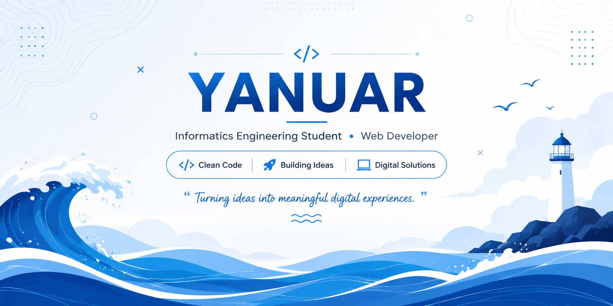

# 👋 Hi, I'm Yanuar

### 🎓 Informatics Engineering Student · 💻 Web Developer

Building ideas into digital experiences.

[🌐 Portfolio](https://github.com/khusaery01/portfolio) •
[💼 GitHub](https://github.com/khusaery01)

I'm a Computer Science student who is interested in web development,
UI/UX design, and building useful digital products.

I enjoy learning new technologies and turning ideas into real projects.

---

## 🚀 About Me

- 🎓 Informatics Engineering Student
- 💻 Interested in Web Development
- 🎨 Interested in UI/UX Design
- 🌱 Currently improving my development skills
- 📍 Indonesia

---

## 🛠️ Tech Stack

### Frontend
HTML • CSS • JavaScript • Flutter

### Backend
PHP • Laravel

### Tools
Git • GitHub • VS Code • Figma

---

## 📌 Featured Projects

### 🛒 Dimves E-Commerce

E-commerce web application built as a college/project application.

### 🌐 Personal Portfolio

My personal portfolio showcasing my projects, skills, and development journey.

---

## 📊 GitHub

Thanks for visiting my profile! 🚀

Feel free to explore my repositories and projects.
